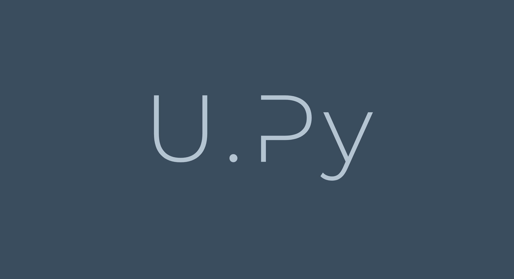

<figure>
    
</figure>

# U.Py Home
A group of python users and enthusiasts to improve upon their python, computing and data-science skill-sets as a community. This is an academic non-profit organization.

# Who could be members? 
Members could be UWM personnel (both current and past).    
+ students 
+ post-docs
+ faculty-members  

# Inspiration for naming it **`U.Py`**
We call it U.Py because it is made for UWM personnel and also as it sounds like _You.Py_, inspiring people to code in python.

---
&copy; U.Py 2020
